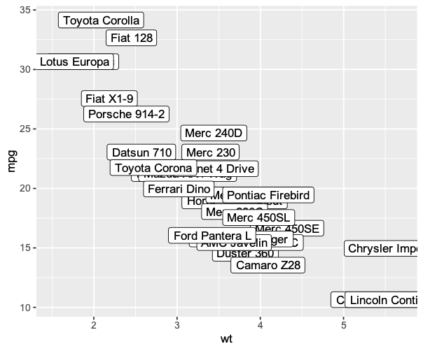
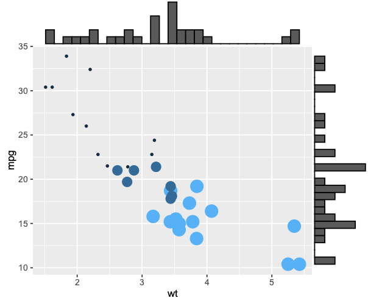
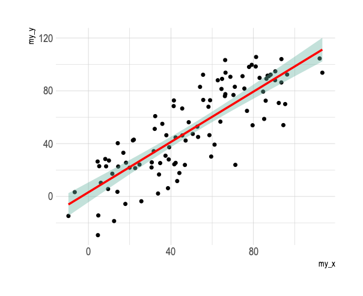

#  Scatter 散点图

<!-- TOC -->
* [Scatter 散点图](#scatter-散点图)
  * [`geom_point`](#geom_point)
    * [普通散点图](#普通散点图)
    * [改变颜色](#改变颜色)
    * [主题](#主题)
    * [分组](#分组)
    * [添加标注](#添加标注)
    * [地毯线](#地毯线)
    * [分布 箱型图 曲线](#分布-箱型图-曲线)
    * [线性拟合](#线性拟合)
<!-- TOC -->

## `geom_point`

### [普通散点图](geompoint_1.R)

### [改变颜色](geompoint_2.R)

### [主题](geompoint_3.R)

### [分组](geompoint_4.R)

### [添加标注](geompoint_5.R)

### [地毯线](geompoint_6.R)

### [分布 箱型图 曲线](geompoint_7.R)

### [线性拟合](geompoint_8.R)

