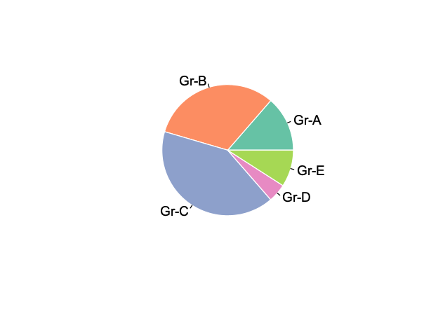

#  § 饼图

<!-- TOC -->
* [§ 饼图](#-饼图)
  * [`pie()`](#pie)
    * [基础](#基础)
    * [填充颜色](#填充颜色)
  * [`geom_bar()` + `coord_polar()`](#geom_bar--coord_polar)
    * [基础](#基础-1)
<!-- TOC -->

## `pie()`

### [基础](pie_1.R)

### [填充颜色](pie_2.R)

## `geom_bar()` + `coord_polar()`

### [基础](coordpolar_1.R)

