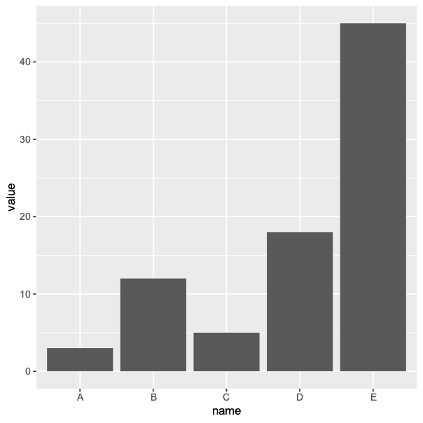

#  R 语言绘图 R language drawing

<!-- TOC -->
* [R 语言绘图 R language drawing](#r-语言绘图-r-language-drawing)
  * [§2 Correlation](#2-correlation)
    * [§2.1 Scatter 散点图](#21-scatter-散点图)
  * [§3 Ranking](#3-ranking-)
    * [§3.1 Bar 柱状图](#31-bar-柱状图)
  * [§4 Part of a Whole](#4-part-of-a-whole)
    * [§4.1 Pie Chart 饼图](#41-pie-chart-饼图)
<!-- TOC -->

## §2 Correlation

### §2.1 [Scatter 散点图](Correlation/Sactter/README.md)

## §3 Ranking 

### §3.1 [Bar 柱状图](Ranking/Bar/README.md)

## §4 Part of a Whole

### §4.1 [Pie Chart 饼图](PartofaWhole/Pie/README.md)

