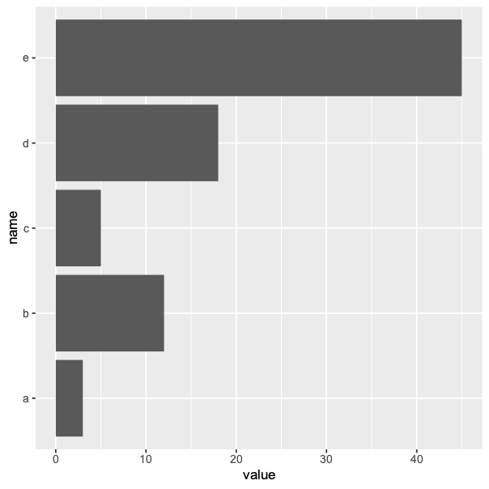

#  § 柱状图

<!-- TOC -->
* [§ 柱状图](#-柱状图)
    * [1. **所属系统不同**](#1-所属系统不同)
    * [2. **数据输入格式**](#2-数据输入格式)
    * [3. **绘图逻辑**](#3-绘图逻辑)
    * [4. **统计转换**](#4-统计转换)
    * [5. **扩展性与定制化**](#5-扩展性与定制化)
    * [6. **输出风格**](#6-输出风格)
    * [何时选择？](#何时选择)
    * [示例对比](#示例对比)
      * [基础R (`barplot`)](#基础r-barplot)
      * [ggplot2 (`geom_bar`)](#ggplot2-geom_bar)
* [`geom_bar`](#geom_bar)
  * [普通柱状图](#普通柱状图)
  * [更改颜色](#更改颜色)
  * [更改宽度](#更改宽度)
  * [水平放置](#水平放置)
* [`barplot`](#barplot)
  * [基础绘图](#基础绘图)
  * [改变颜色](#改变颜色)
  * [标题](#标题)
  * [水平放置](#水平放置-1)
<!-- TOC -->


---

在R中，`ggplot2`包中的`geom_bar()`和基础图形系统中的`barplot()`都是用于绘制条形图的函数，但它们在语法、灵活性、数据结构和扩展性等方面有显著区别。以下是主要区别的总结：

---

### 1. **所属系统不同**
- **`barplot()`**  
  属于R的**基础图形系统**（base R），无需安装额外包，直接使用。
  ```r
  barplot(height = c(10, 20, 30), names.arg = c("A", "B", "C"))
  ```

- **`geom_bar()`**  
  属于**`ggplot2`**包（基于图形语法Grammar of Graphics），需先加载`ggplot2`。
  ```r
  library(ggplot2)
  ggplot(data = df, aes(x = category, y = value)) + geom_bar(stat = "identity")
  ```

---

### 2. **数据输入格式**
- **`barplot()`**  
  通常直接接受**向量或矩阵**作为输入（如`height`参数），需手动指定类别标签（`names.arg`）。
  ```r
  barplot(height = c(10, 20, 30), names.arg = c("A", "B", "C"))
  ```

- **`geom_bar()`**  
  需要**数据框（data.frame）**作为输入，并通过美学映射（`aes()`）指定变量。支持长格式数据，更适合复杂数据。
  ```r
  df <- data.frame(category = c("A", "B", "C"), value = c(10, 20, 30))
  ggplot(df, aes(x = category, y = value)) + geom_bar(stat = "identity")
  ```

---

### 3. **绘图逻辑**
- **`barplot()`**  
  是**命令式**的：直接指定图形属性（如颜色、边框等），一步生成图像。
  ```r
  barplot(height = c(10, 20, 30), col = "skyblue", border = "black")
  ```

- **`geom_bar()`**  
  是**声明式**的：通过叠加图层（`+`）逐步构建图形，支持分面、主题等高级功能。
  ```r
  ggplot(df, aes(x = category, y = value, fill = category)) + 
    geom_bar(stat = "identity") +
    theme_minimal()
  ```

---

### 4. **统计转换**
- **`geom_bar()`**  
  默认使用**统计转换**（`stat_count`），即自动计算频数（无需提供`y`值）。若需绘制原始值，需设置`stat = "identity"`。
  ```r
  # 自动统计频数
  ggplot(df, aes(x = category)) + geom_bar()
  
  # 直接使用y值
  ggplot(df, aes(x = category, y = value)) + geom_bar(stat = "identity")
  ```

- **`barplot()`**  
  无自动统计功能，需提前计算好频数或数值。

---

### 5. **扩展性与定制化**
- **`ggplot2`（`geom_bar`）**  
  - 支持分面（`facet_wrap()`/`facet_grid()`）、图例、主题系统等。  
  - 易于添加其他图层（如`geom_text`、`geom_line`）。  
  - 适合复杂图形和出版级调整。

- **`barplot()`**  
  - 定制化依赖基础图形参数（如`col`, `main`, `xlab`等）。  
  - 扩展性较弱，多层叠加较麻烦。

---

### 6. **输出风格**
- **`ggplot2`**  
  默认现代化风格（灰色背景、无边框），可通过`theme_*()`快速调整。
- **`barplot()`**  
  基础R风格（白色背景，简单边框）。

---

### 何时选择？
- **用`barplot()`**：快速绘制简单条形图，无需额外依赖。
- **用`geom_bar()`**：需要复杂可视化、数据为data.frame、或需与其他`ggplot2`功能集成时。

---

### 示例对比
#### 基础R (`barplot`)
```r
counts <- table(mtcars$cyl)
barplot(counts, col = "steelblue", main = "Number of Cars by Cylinder")
```

#### ggplot2 (`geom_bar`)
```r
library(ggplot2)
ggplot(mtcars, aes(x = factor(cyl))) + 
  geom_bar(fill = "steelblue") + 
  labs(title = "Number of Cars by Cylinder")
```

输出结果类似，但`ggplot2`代码更易扩展（如添加颜色分组的`fill`美学）。

---

---
以下是使用 `barplot` 和 `geom_bar` 的一些示例和


# `geom_bar`

## [普通柱状图](geombar.R)


## [更改颜色](geombar_2.R)


## [更改宽度](geombar_3.R)


## [水平放置](Horizontal_barplot.R)



# `barplot`

## [基础绘图](barplot.R)


## [改变颜色](barplot_2.R)


## [标题](barplot_3.R)


## [水平放置](barplot_4.R)

